#  게임 관리 REST API (sb_game-crud)

Spring Boot로 만든 게임 정보 관리 REST CRUD API이다.
데이터베이스 없이 Java Collection(`LinkedHashMap`)에 데이터를 저장하며, Render에 Docker로 배포했다.

- **GitHub Repository**: https://github.com/2026-2-WebService/assign05-c01-22500091
- **배포 URL**: https://sb-game-crud.onrender.com

---

## ① 프로젝트 소개

### 주제와 관리하는 데이터

좋아하는 게임의 정보(이름, 제작사, 가격, 장르, 플레이타임)를 등록하고 조회·수정·삭제하는 API이다.

| 필드 | 타입 | 설명 | 예시 |
|---|---|---|---|
| id | Long | 게임 번호 (서버가 자동 생성) | 1 |
| name | String | 게임 이름 | 엘든 링 |
| company | String | 제작사 | 프롬소프트웨어 |
| price | int | 가격 (원) | 64800 |
| genre | String | 장르 | RPG |
| playTime | int | 플레이타임 (시간) | 60 |

### 프로젝트 구조

```
src/main/java/org/example/week04/week_05_sb_game_crud_solution
 ├─ Week05SbGameCrudSolutionApplication.java   
 ├─ controller
 │   └─ GameController.java        
 ├─ service
 │   └─ GameService.java           
 ├─ repository
 │   ├─ GameRepository.java       
 │   └─ MemoryGameRepository.java  
 ├─ domain
 │   └─ Game.java                 
 └─ dto
     ├─ GameRequest.java           
     └─ GameResponse.java          
```

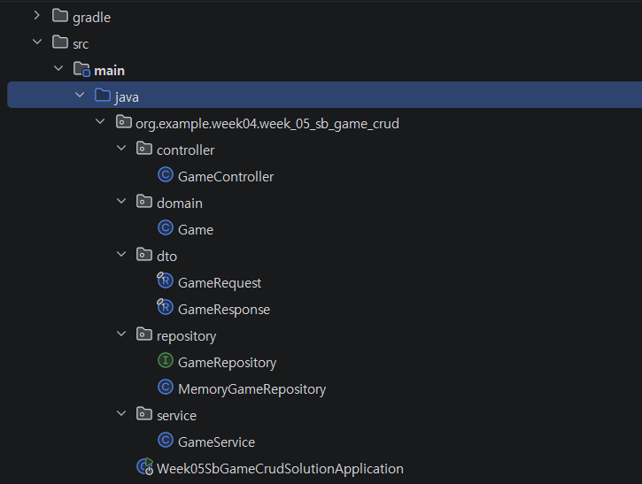

요청 처리 흐름은 다음과 같다.

```
Client(Postman) → GameController → GameService → GameRepository(인터페이스) → MemoryGameRepository → LinkedHashMap
```

### 로컬 실행 방법

1. 저장소를 clone 한 뒤 IntelliJ에서 프로젝트를 연다.
2. Gradle 로딩이 끝나면 `Week05SbGameCrudSolutionApplication.java`의 `main` 메서드를 실행한다.
3. 콘솔에 `Tomcat started on port 8080`이 출력되면 `http://localhost:8080/api/games`로 요청을 보낼 수 있다.

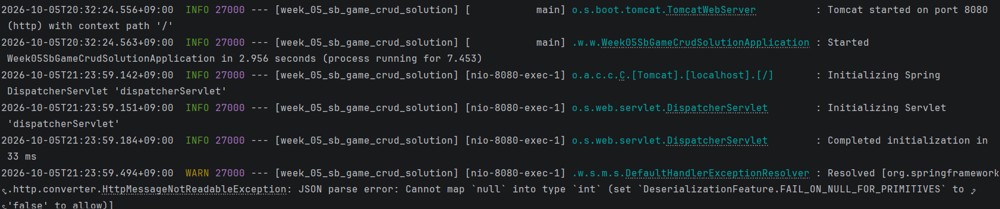

### API Endpoint

| HTTP Method | URL | 기능 | 성공 응답 | 실패 응답 |
|---|---|---|---|---|
| POST | `/api/games` | 게임 등록 | 201 Created | 400 (잘못된 입력) |
| GET | `/api/games` | 전체 조회 | 200 OK | - |
| GET | `/api/games/{id}` | 단건 조회 | 200 OK | 404 (없는 ID) |
| PUT | `/api/games/{id}` | 게임 수정 | 200 OK | 400 (잘못된 입력), 404 (없는 ID) |
| DELETE | `/api/games/{id}` | 게임 삭제 | 204 No Content | 404 (없는 ID) |
| GET | `/api/games/search?genre={장르}` | 장르로 필터링 | 200 OK | - |

### 요청·응답 JSON 예시

**등록 요청** `POST /api/games`

```json
{
  "name": "엘든 링",
  "company": "프롬소프트웨어",
  "price": 64800,
  "genre": "RPG",
  "playTime": 60
}
```

**등록 응답** `201 Created`

```json
{
  "id": 1,
  "name": "엘든 링",
  "company": "프롬소프트웨어",
  "price": 64800,
  "genre": "RPG",
  "playTime": 60
}
```

---

## ② 개발환경 및 Dependency

| 항목 | 작성 내용                                                                |
|---|----------------------------------------------------------------------|
| IDE | IntelliJ IDEA 2025.3.4                                               |
| JDK | 17                                                                   |
| Spring Boot | 4.1.1                                                                |
| Build Tool | Gradle 9.7.1                                                         |
| 데이터 저장 | Java Collection `LinkedHashMap<Long, Game>` (`MemoryGameRepository`) |
| 배포 환경 | Render Web Service (Docker 방식) — https://sb-game-crud.onrender.com   |
| API 테스트 | Postman                                                              |

### 사용한 Dependency

| Dependency | 필요한 이유 |
|---|---|
| **Spring Web** (`spring-boot-starter-web`) | REST API를 만들기 위해 선택했다. `@RestController`, `@GetMapping`, `@PostMapping` 등으로 URL과 HTTP Method를 연결하고, `@RequestBody`로 받은 JSON을 `GameRequest` 객체로 바꾸며, 응답할 때 `GameResponse`를 JSON으로 바꿔 준다. 내장 Tomcat 서버가 포함되어 있어 별도 서버 설치 없이 실행할 수 있다. |

---

## ③ Solution 분석

제공된 Book CRUD Solution을 실행하고 코드를 따라가며 정리한 내용이다.

### Q1. `POST /api/books` 요청은 어떤 순서로 처리되는가?
**A.** `BookController.create()`가 요청 JSON을 `@RequestBody`로 받아 `BookRequest`로 만든 뒤 `BookService.create()`를 호출한다. `BookService.create()`는 `BookRequest`의 값으로 `Book` 객체를 만들고 `BookRepository.save()`를 호출한다. 실제로는 구현체인 `MemoryBookRepository.save()`가 실행되어 `store`(Map)에 저장한다. 저장된 `Book`은 `BookService.toResponse()`에서 `BookResponse`로 바뀌고, `BookController.create()`가 `ResponseEntity.status(HttpStatus.CREATED)`로 201과 함께 반환한다.

### Q2. 새 데이터의 ID는 어디서 생성되는가?
**A.** `MemoryBookRepository.save()`에서 생성된다. 클래스 안의 `sequence` 변수를 `++sequence`로 1 증가시킨 뒤 `book.setId()`로 넣는다. `BookService.create()`에서는 `new Book(null, ...)`처럼 id를 `null`로 넘기므로 ID를 정하는 책임은 Repository에 있다.

### Q3. `BookRequest`, `Book`, `BookResponse`는 각각 왜 필요한가?
**A.** `BookRequest`는 클라이언트가 보내는 데이터이며, id는 서버가 만들기 때문에 id 필드가 없다. `Book`은 저장소(`MemoryBookRepository`)에서 관리하는 Domain 객체로, setter가 있어 `BookService.update()`에서 값을 바꿀 수 있다. `BookResponse`는 클라이언트에게 돌려줄 데이터로 id를 포함한다. 이렇게 나누면 저장 객체(`Book`)를 바깥에 그대로 노출하지 않고 입력과 출력에 필요한 값만 주고받을 수 있다.

### Q4. Domain 객체는 어떻게 Response DTO로 바뀌는가?
**A.** `BookService.toResponse()`가 `Book`의 getter(`getId()`, `getTitle()`, `getAuthor()`, `getPrice()`)로 값을 꺼내 `new BookResponse(...)`를 만든다. 전체 조회인 `BookService.findAll()`에서는 `repository.findAll().stream().map(this::toResponse).toList()`로 `List<Book>`의 모든 요소를 `List<BookResponse>`로 바꾼다.

### Q5. 서버를 재시작하면 등록한 데이터는 어떻게 되는가?
**A.** 사라진다. `MemoryBookRepository`의 `store`는 프로그램 메모리에 있는 `LinkedHashMap` 변수일 뿐이므로, 프로그램이 종료되면 함께 사라지고 다시 실행하면 빈 Map과 `sequence = 0`부터 시작한다.

---

## ④ 개발 과정 요약

### 1단계. 프로젝트 생성
- **작업**: IntelliJ에서 Spring Boot(Gradle, Spring Web) 프로젝트를 만들고 GitHub 저장소와 연결했다.
- **확인**: `Application.main()` 실행 후 콘솔에서 `Tomcat started on port 8080`을 확인했다.

### 2단계. Domain·DTO 작성
- **작업**: 필드 5개를 설계하고 `Game`, `GameRequest`, `GameResponse`를 작성했다.
- **확인**: 빌드 오류 없이 실행되는 것을 확인했다.

### 3단계. Repository 작성
- **작업**: `GameRepository` 인터페이스와 `MemoryGameRepository`를 작성했다. `save()`에서 `sequence`로 ID를 자동 생성하고 `LinkedHashMap`에 저장한다.
- **확인**: POST 요청 시 id가 1, 2 순서로 생성되는 것을 확인했다.

### 4단계. Service·Controller 작성
- **작업**: `GameService`와 `GameController`에 CRUD 메서드(`create`, `findAll`, `findById`, `update`, `delete`)를 작성했다. 없는 ID는 404를 반환한다.
- **확인**: Postman으로 등록 → 조회 → 수정 → 삭제 → 404 흐름을 테스트했다.

### 5단계. 기능 확장과 배포
- **작업**: `GameService.isValid()`(400 처리)와 `GameService.findByGenre()`(장르 필터)를 추가하고, `Dockerfile`을 작성해 Render에 배포했다.
- **확인**: 배포 URL로 GET, POST, 장르 필터 요청을 보내 응답을 확인했다.

### 로컬 테스트 결과 (STEP 6)

| 순서 | 요청 | 기대 결과 | 캡처                      |
|---|---|---|-------------------------|
| 1 | `POST /api/games` | 201 Created, id 생성 | 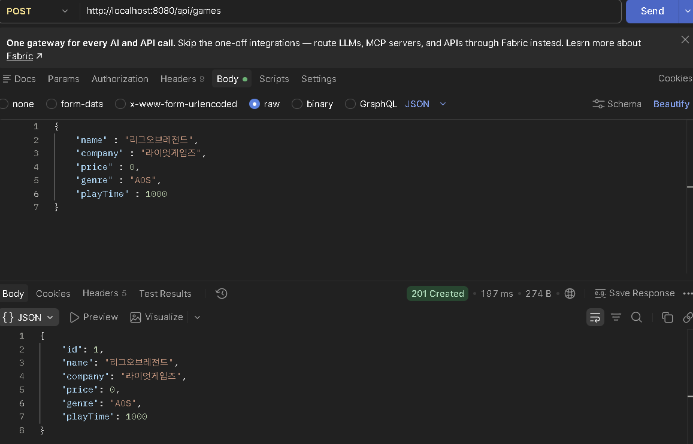 |
| 2 | `GET /api/games` | 200 OK, 전체 목록 |  |
| 3 | `GET /api/games/1` | 200 OK | 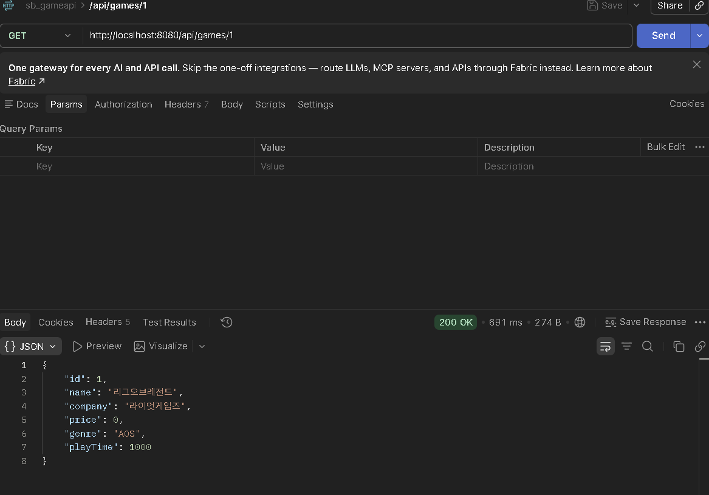 |
| 4 | `PUT /api/games/1` | 200 OK, 수정된 값 | 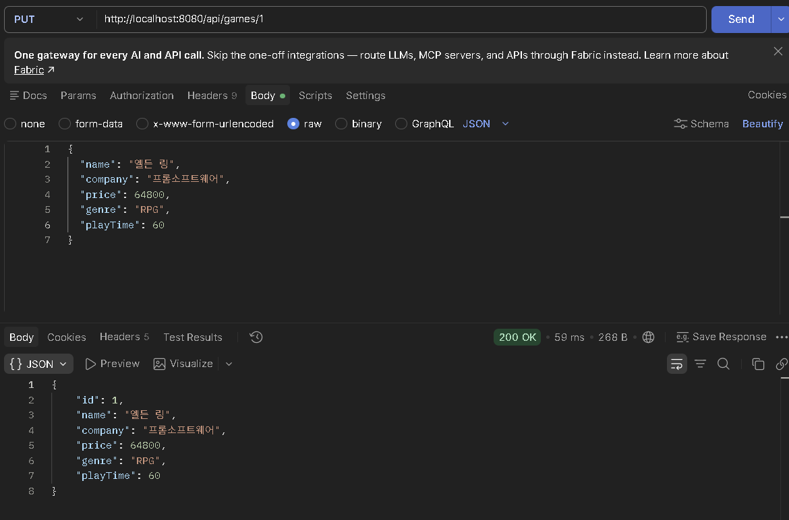 |
| 5 | `GET /api/games/1` | 200 OK, 수정 결과 확인 | 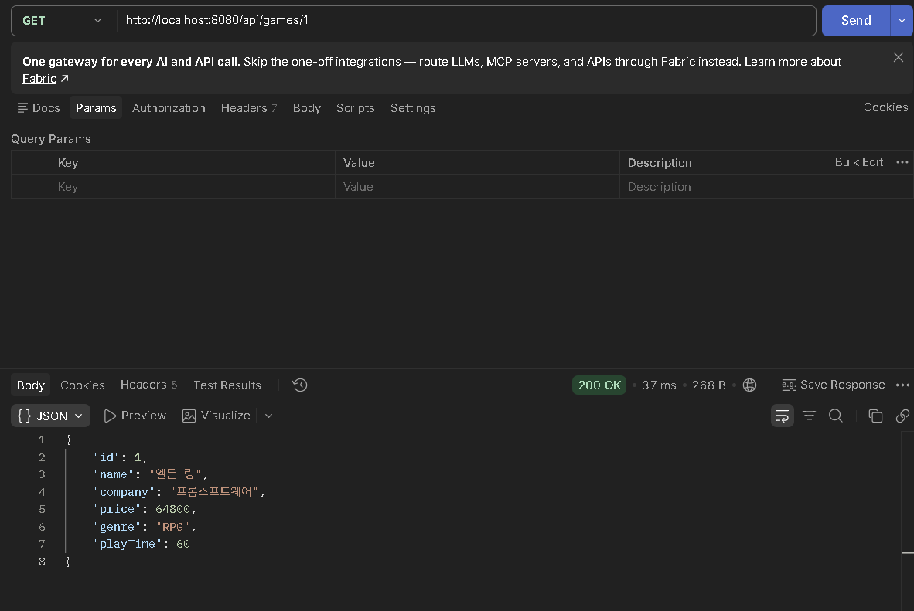 |
| 6 | `DELETE /api/games/1` | 204 No Content | 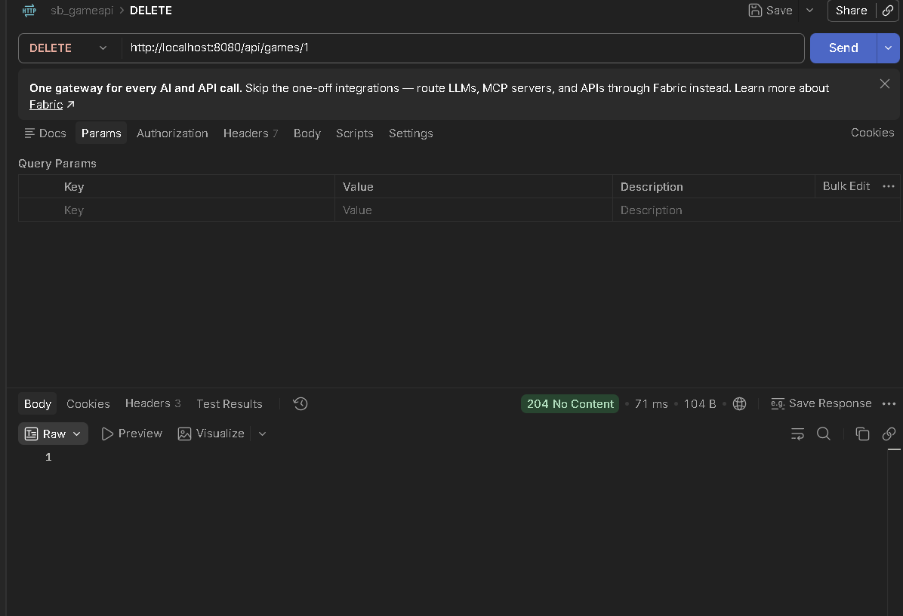 |
| 7 | `GET /api/games/1` | 404 Not Found | 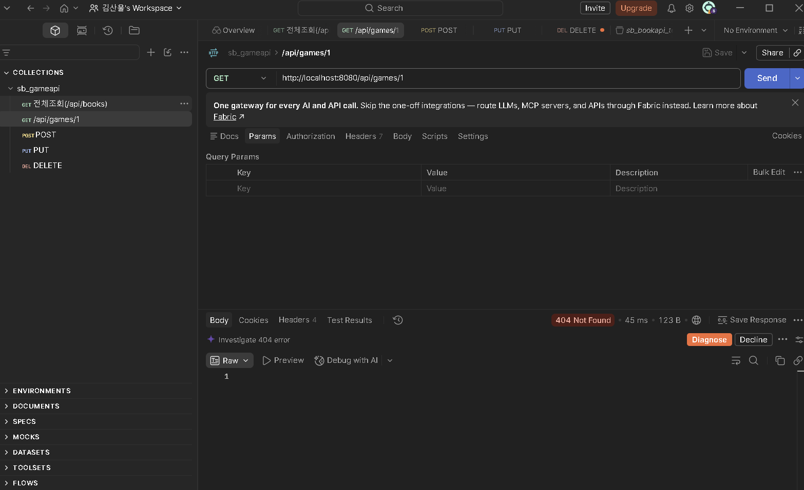 |

---

## ⑤ 기능 수정·확장

### A. 잘못된 입력 처리

**추가한 이유**
게임 이름·제작사·장르가 비어 있거나 가격·플레이타임이 음수인 데이터는 의미가 없다. 이런 값이 저장되지 않도록 등록과 수정 전에 입력을 검사하도록 했다.

**검사 기준**
- `name`, `company`, `genre`가 `null`이거나 빈 문자열이면 400을 반환한다.
- `price` 또는 `playTime`이 음수이면 400을 반환한다.

**수정한 클래스와 메서드**
- `GameService.isValid(GameRequest request)`: 위 조건을 if문으로 하나씩 검사하고, 하나라도 해당하면 `false`를 반환한다.
- `GameController.create()`, `GameController.update()`: 처리 전에 `isValid()`를 호출하고, `false`이면 `ResponseEntity.badRequest().build()`로 400을 반환한다.

**테스트 요청과 예상 결과**

| 테스트 | 요청 Body | 예상 결과 |
|---|---|---|
| 정상 입력 | `{"name":"발로란트","company":"라이엇 게임즈","price":0,"genre":"FPS","playTime":100}` | 201 Created |
| 가격 음수 | `"price": -1000` | 400 Bad Request |
| 이름 비어 있음 | `"name": ""` | 400 Bad Request |

**실제 결과**
정상 입력 : 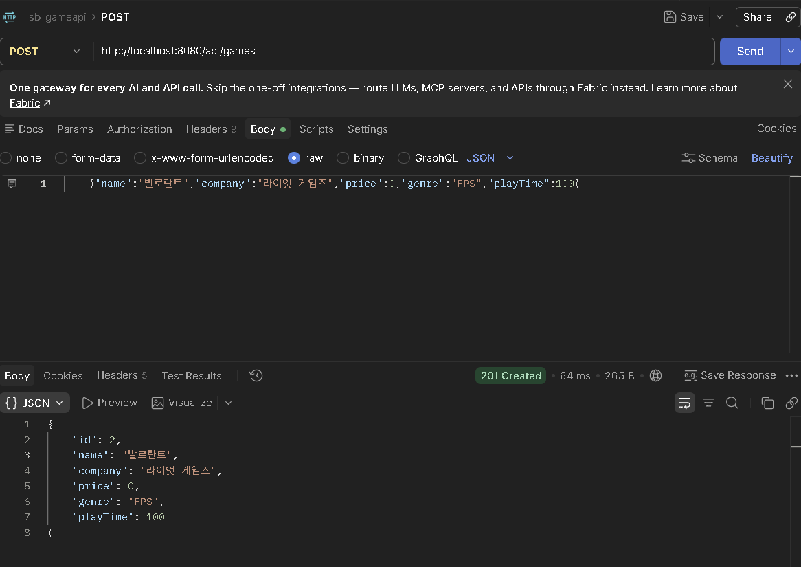
가격 음수 : 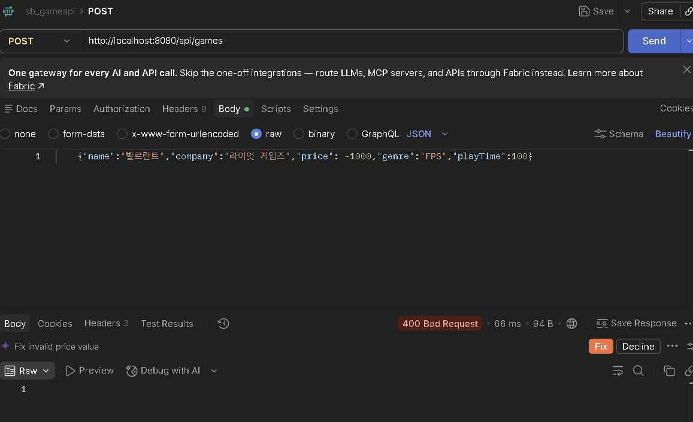
이름 빈 문자열 : 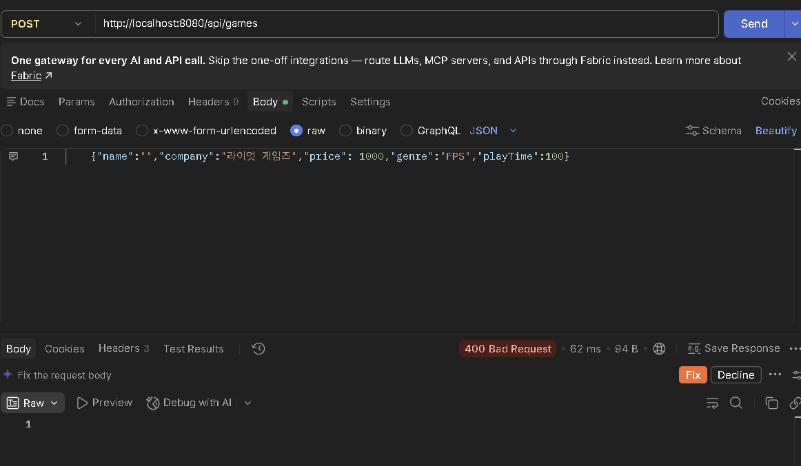

### B. 조회 기능 확장 — 장르로 필터링

**추가한 이유**
게임이 많아지면 원하는 장르의 게임만 골라 보고 싶을 것이라 생각하여 장르 필터를 추가했다.

**URL과 요청 조건**
- `GET /api/games/search?genre={장르}`
- 저장된 게임 중 `genre`가 요청한 값과 **정확히 같은** 게임만 반환한다. (대소문자 구분)
- 조건에 맞는 게임이 없으면 빈 목록 `[]`을 반환한다.

**수정한 클래스와 메서드**
- `GameService.findByGenre(String genre)`: `gameRepository.findAll()`의 게임을 for문으로 하나씩 확인하여 `game.getGenre().equals(genre)`인 게임만 결과 리스트에 담는다.
- `GameController.findByGenre()`: `@GetMapping("/search")`와 `@RequestParam`으로 genre 값을 받아 Service를 호출한다.

**테스트 요청과 예상 결과**

| 테스트 | 요청 | 예상 결과 |
|---|---|---|
| 조건에 맞는 데이터 | `GET /api/games/search?genre=FPS` | FPS 게임만 반환 |
| 조건에 맞지 않는 데이터 | `GET /api/games/search?genre=퍼즐` | `[]` |

> 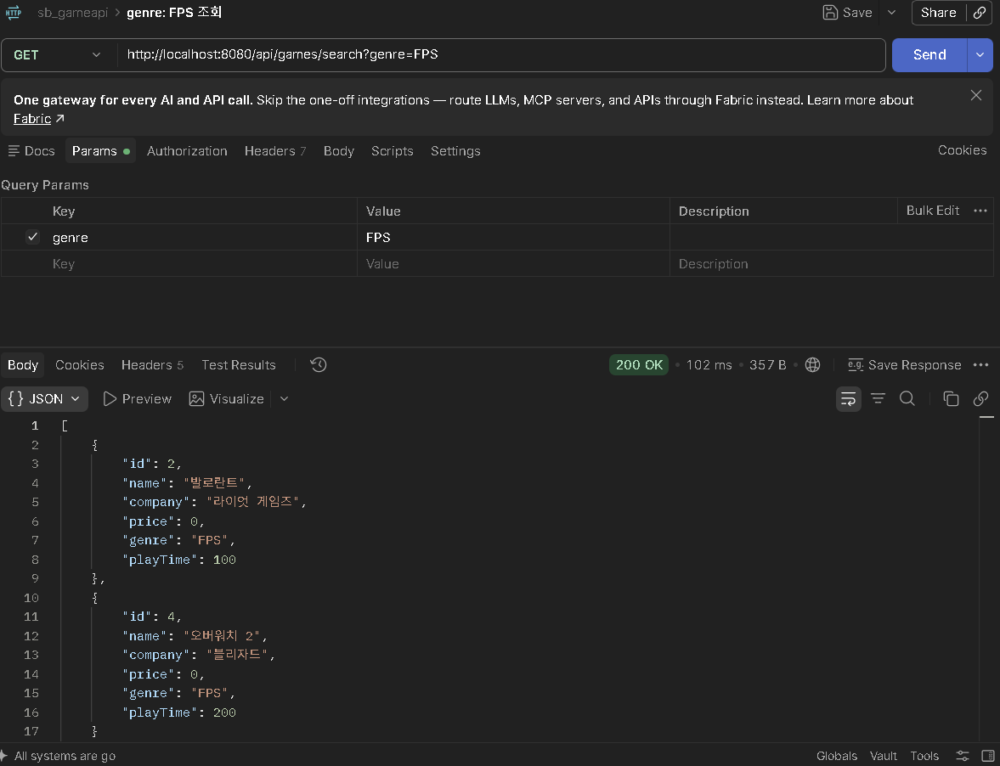 `genre=FPS` 결과
> 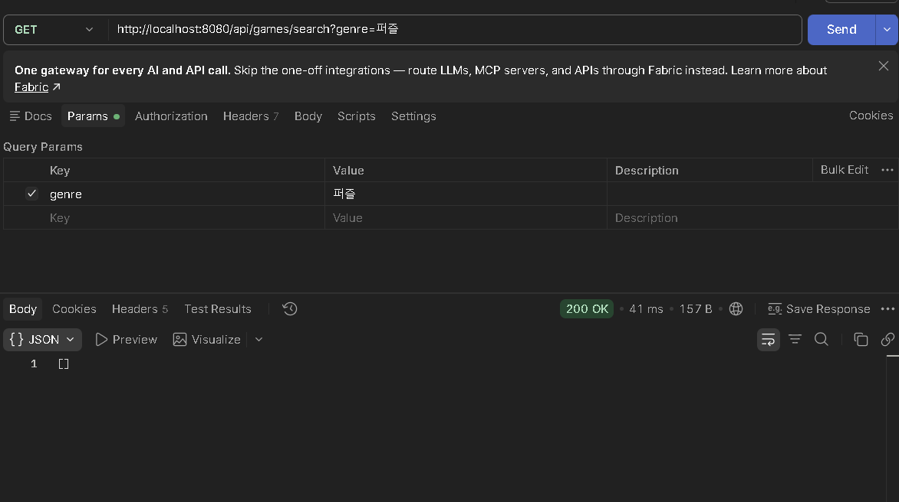 `genre=퍼즐` 결과 `[]`

---

## ⑥ 배포 과정 요약

### 배포 순서
1. 프로젝트 루트(`build.gradle`과 같은 위치)에 `Dockerfile`을 추가했다.
2. `application.properties`에 Render가 지정하는 포트를 사용하도록 설정을 추가했다.
3. 변경 사항을 Commit 하고 GitHub에 Push 했다.
4. Render에서 **New → Web Service**로 GitHub 저장소를 연결하고, **Language를 Docker**, Instance Type을 Free로 선택하여 배포했다.
5. 로그에서 애플리케이션이 시작된 것을 확인하고 배포 URL로 Postman 테스트를 진행했다.

### 추가·수정한 파일

**Dockerfile**

```dockerfile
FROM gradle:8.14-jdk17 AS build
WORKDIR /app
COPY . .
RUN gradle bootJar --no-daemon

FROM eclipse-temurin:17-jre
WORKDIR /app
COPY --from=build /app/build/libs/*.jar app.jar
EXPOSE 8080
ENTRYPOINT ["java", "-jar", "app.jar"]
```

- 첫 번째 단계(`gradle` 이미지)에서 `gradle bootJar`로 실행 가능한 jar 파일을 만든다.
- 두 번째 단계(`eclipse-temurin` JRE 이미지)에서 그 jar 파일을 `java -jar`로 실행한다.

**application.properties**

```properties
server.port= 8080
```

- `application.properties`에 서버 포트를 8080으로 지정했다.

### 배포 중 발생한 문제와 해결

| 문제 | 원인 | 해결 |
|---|---|---|
| 첫 배포에서 `Deploy failed`가 발생했고, 로그에 `Running 'yarn start'`, `Couldn't find a package.json file`이 출력됨 | Render 서비스를 만들 때 Language가 Node로 선택되어, 자바 프로젝트를 Node.js 프로젝트처럼 실행하려 했음 | Render는 Java 런타임을 직접 제공하지 않으므로 `Dockerfile`을 추가하고, 서비스를 **Language: Docker**로 다시 만들어 배포함 |

### 배포 URL로 확인한 요청과 응답

| 요청 | 기대 결과 | 캡처 |
|---|---|---|
| `POST https://sb-game-crud.onrender.com/api/games` | 201 Created | 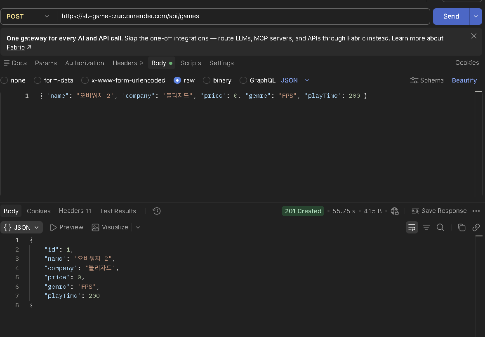 |
| `GET https://sb-game-crud.onrender.com/api/games` | 200 OK, 등록한 게임 | 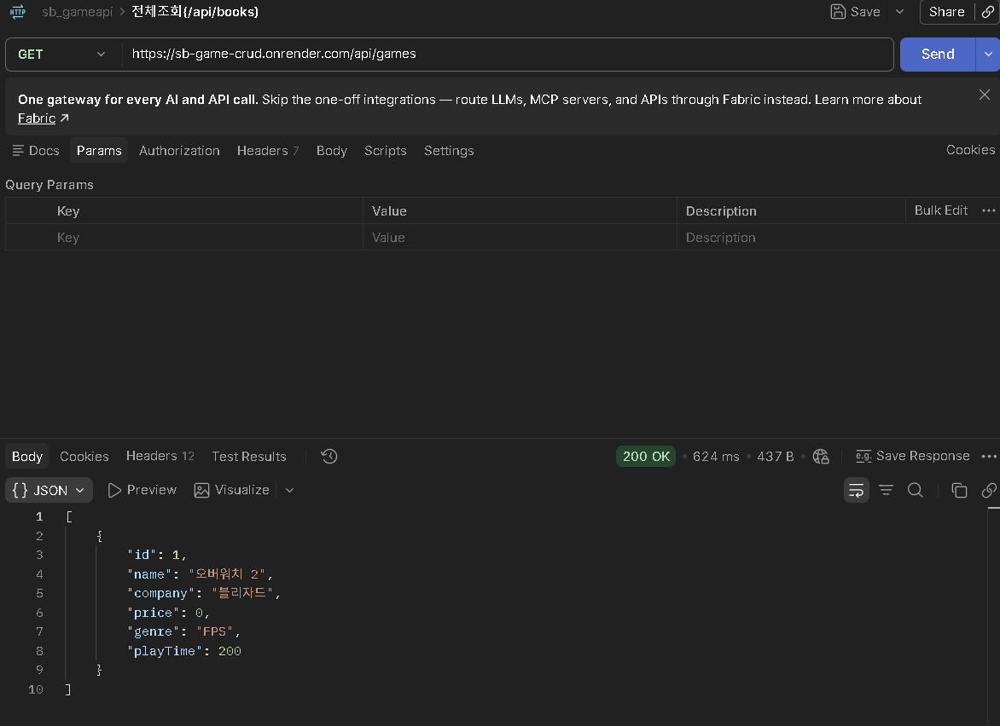 |

---

## ⑦ Weekly Report

### Key Learning
1. **계층을 나누는 이유**: Controller는 요청·응답과 상태 코드, Service는 처리 로직, Repository는 저장만 맡는다. Service가 `GameRepository` 인터페이스에 의존하기 때문에, 나중에 Memory 저장소를 DB 저장소로 바꿔도 Service 코드는 거의 그대로 둘 수 있다는 것을 이해했다.
2. **DTO를 따로 쓰는 이유**: `GameRequest`에는 id가 없고 `GameResponse`에는 id가 있다. 클라이언트가 id를 마음대로 정하지 못하게 하고, 저장 객체인 `Game`을 바깥에 직접 노출하지 않기 위해 나눈다는 것을 알게 되었다.
3. **HTTP 상태 코드**: 같은 요청이라도 결과에 따라 201(등록), 200(조회·수정), 204(삭제), 400(잘못된 입력), 404(없는 데이터)를 다르게 돌려줘야 하며, `ResponseEntity`로 이를 직접 정할 수 있다는 것을 배웠다.

### Problem & Solution
- **문제**: `Game` 클래스의 생성자와 getter/setter를 빠르게 만들기 위해 IntelliJ의 Generate(Alt + Insert) 기능을 사용했는데, 필드가 들어간 생성자가 만들어지지 않았다.
- **원인**: `Choose Fields to Initialize by Constructor` 창에서 맨 위의 클래스 줄(`domain.Game`)만 선택된 상태로 OK를 눌렀다. 필드(id, name, company, price, genre, playTime)는 하나도 선택되지 않았기 때문에 원하는 생성자가 만들어지지 않았다.
- **해결**: 창에서 `id`를 클릭한 뒤 Shift를 누른 채 `playTime`을 클릭해 6개 필드를 모두 선택하고 OK를 눌렀다. Getter and Setter도 같은 방법으로 생성했다. 이후 `GameService.create()`에서 `new Game(null, ...)`이 오류 없이 동작하는 것을 확인했다.

### Code Review — `GameController.update()`

```java
@PutMapping("/{id}")
public ResponseEntity<GameResponse> update(@PathVariable Long id, @RequestBody GameRequest request) {
    if (!gameService.isValid(request)) {
        return ResponseEntity.badRequest().build();
    }
    GameResponse response = gameService.update(id, request);
    if (response == null) {
        return ResponseEntity.notFound().build();
    }
    return ResponseEntity.ok(response);
}
```

1. `@PathVariable`로 URL의 `{id}`를, `@RequestBody`로 요청 JSON을 `GameRequest`로 받는다.
2. `GameService.isValid()`로 입력을 먼저 검사하고, 잘못된 값이면 저장하지 않고 바로 **400**을 반환한다.
3. 입력이 정상이면 `GameService.update()`를 호출한다. Service는 `MemoryGameRepository.findById()`로 게임을 찾고, 없으면 `null`을 반환한다.
4. `null`이면 **404**를 반환하고, 찾았으면 setter로 값을 바꾼 결과를 `GameResponse`로 받아 **200**과 함께 반환한다.

### AI Usage
- **질문한 내용**: Solution 코드 분석 방법, 직접 짠 코드 평가 및 발전 방향 제시, `LinkedHashMap`과 `sequence`의 의미, Postman 테스트 방법, Render 배포 실패 원인(yarn / package.json 에러), POST 400 에러 원인
- **참고한 답변**: Controller → Service → Repository 구조의 기초 코드, `Dockerfile` 작성과 Render의 Language를 Docker로 바꾸는 해결 방법, JSON 키 대소문자 문제
- **직접 확인·수정한 부분**: `Game`의 생성자·getter/setter를 IntelliJ Generate로 직접 생성했으며, 모든 클래스를 직접 개발해보면서 기초적인 부분을 다졌다. 모든 API를 Postman으로 직접 테스트했다.

### Reflection
 기본적인 CRUD 프로그램에 배포를 진행하면서 이 구조에 대해서 점점 이해해간다고 느낀다. 여기서 연계하여, 서버 재시작 후에도 데이터가 남도록 실제 데이터베이스(JPA, MySQL)를 연결하는 방법을 공부하고 싶다, 또한 400 응답에 오류 이유 메시지를 담는 방법이 궁금하다.

### 건의사항
과제 중간중간에 어떤 결과를 첨가하라는 글이 섞여있어서 정리하느라 시간이 지체되었습니다. README에 넣어야할 내용이 좀 더 정확하게 정리되어있으면 좋겠습니다. 또는 captures 파일을 생성하여 실행화면들을 캡쳐시키게끔 하는것도 좋은 방법이라고 생각합니다.